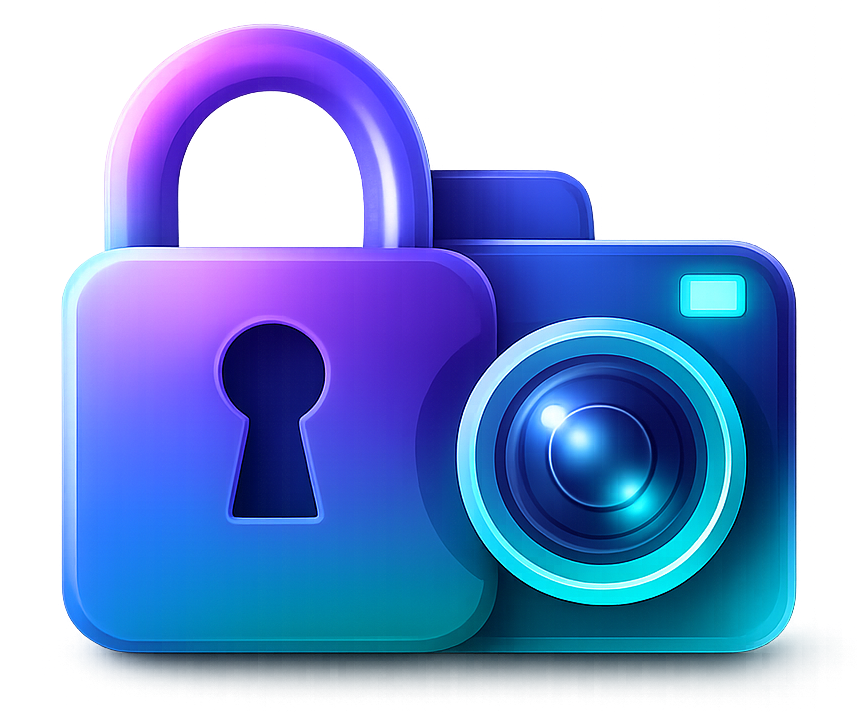
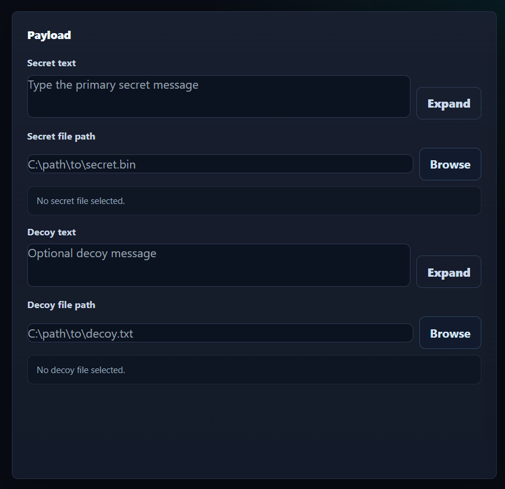
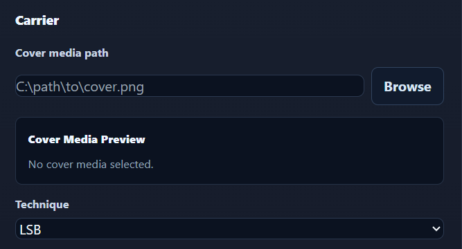
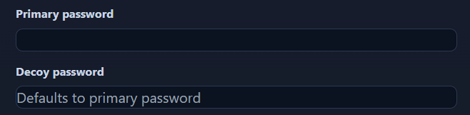
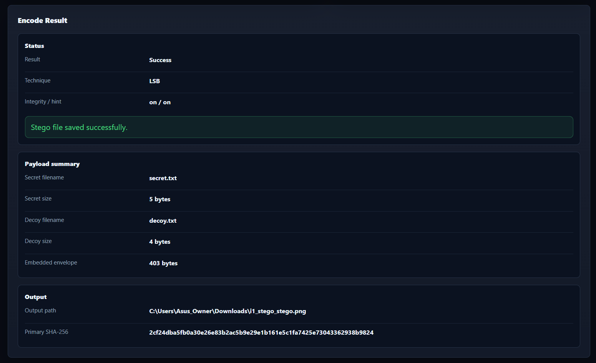
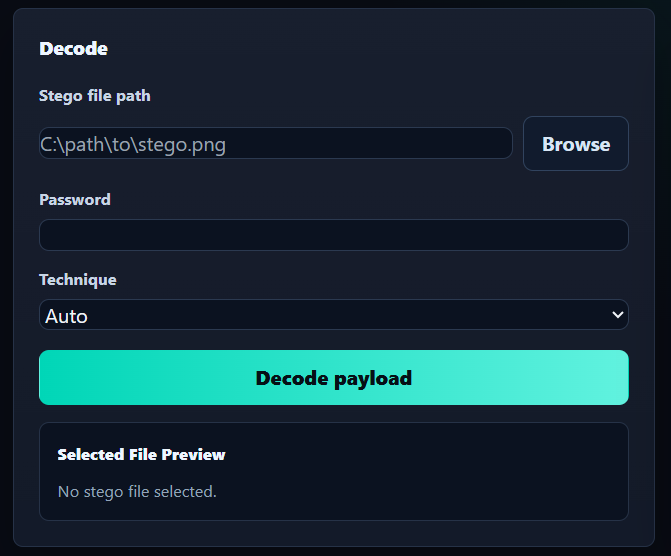
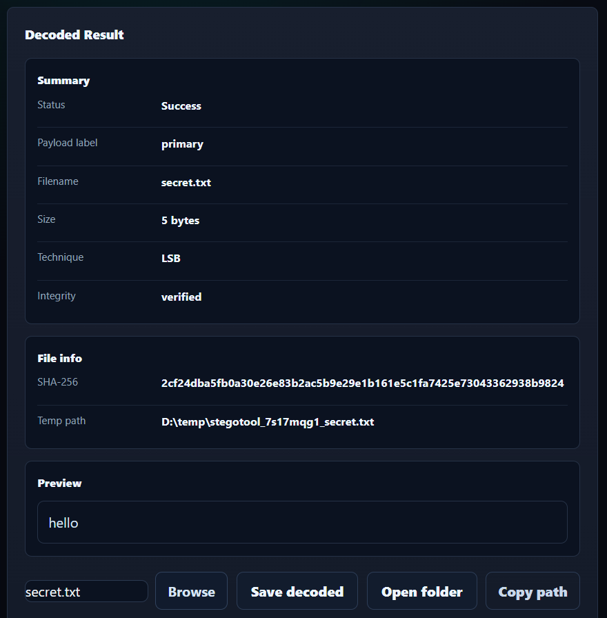

# 🔐 StegoTool Pro

<p align="center">
  
</p>

<p align="center">
  <strong>Hide and extract data in images, audio, and video — securely and locally.</strong>
</p>

<p align="center">
  <a href="https://github.com/iJainamJain/StegoTool-Pro/releases/tag/v1.0.0">
    
  </a>
  <a href="https://github.com/iJainamJain/StegoTool-Pro/releases/download/v1.0.0/StegoToolPro-Setup-1.0.0.exe">
    
  </a>
</p>

<p align="center">
  
  
  
</p>

---

## 📌 Overview

StegoTool Pro is a desktop steganography application that allows users to securely embed and extract hidden data within image, audio, and video files.

It combines a modern desktop UI with local processing, encryption support, media preview, and guided workflows for both encoding and decoding.

## 💡 Why StegoTool Pro?

StegoTool Pro was built to demonstrate practical steganography combined with real-world usability.

Unlike basic implementations, it focuses on:
- Multi-media support (image, audio, video)
- Secure encryption with integrity checks
- Decoy-based plausible deniability
- Desktop-first user experience with previews

The goal was to bridge the gap between theoretical steganography and a usable software product.

---

## ✨ Features

- 🔒 Encode secret data into media files
- 🔓 Decode hidden data with integrity verification
- 🕵️ Decoy password support for plausible deniability
- 🎬 Built-in preview for image, audio, and video
- 💻 Desktop application with guided workflow
- ⚡ Fully local processing with no external API dependency
- 📘 Tutorial page for first-time users

---

## 📦 Download

<p align="center">
  <a href="https://github.com/iJainamJain/StegoTool-Pro/releases/download/v1.0.0/StegoToolPro-Setup-1.0.0.exe">
    
  </a>
</p>

### Installation

1. Download the installer
2. Run `StegoToolPro-Setup-1.0.0.exe`
3. Complete installation
4. Launch from Start Menu or Desktop

> ⚠️ Windows may show a SmartScreen warning because the app is not code-signed yet.  
> Click **More info → Run anyway**.

---

## 🎯 How It Works

1. Select your **secret payload** (text or file)
2. Choose a **carrier media file** (image, audio, or video)
3. Set **password(s)** for security and optional decoy
4. Click **Encode** to generate the stego file
5. Use **Decode** with the correct password to extract data

---

## 🖼️ Guided Walkthrough

### Encode Workflow

#### Step 1 — Add your payload

Enter secret text or choose a secret file. You can also include a decoy text or file payload for plausible deniability.

<p align="center">
  
</p>

#### Step 2 — Choose carrier media

Select the image, audio, or video file that will carry the hidden data, then choose the appropriate steganography technique.

<p align="center">
  
</p>

#### Step 3 — Set passwords and options

Use the primary password to protect the real payload. Optionally set a decoy password and enable controls such as integrity tag and technique hinting.

<p align="center">
  
</p>

#### Step 4 — Review the result

After encoding, the result view shows the status, output location, payload summary, and related metadata.

<p align="center">
  
</p>

### Decode Workflow

#### Step 1 — Select the encoded file

Choose the stego file, enter the password, select Auto or a specific technique mode, and start the decode process.

<p align="center">
  
</p>

#### Step 2 — Review the decoded output

The result view shows recovered file details, integrity status, preview support, and output actions such as save, open folder, and copy path.

<p align="center">
  
</p>

---

## ⚙️ Tech Stack

- **Frontend:** HTML, CSS, JavaScript
- **Desktop Shell:** PyWebView
- **Backend:** FastAPI

**Core Libraries:**
- NumPy
- PyCryptodome
- Pillow
- AV

---

## 🔐 Security Notes

- All processing is performed locally
- No data is sent to external services
- Supports encrypted payload handling
- Integrity verification ensures correctness of decoded output

---

## 📁 Project Structure

```text
stego_app/
├── app/              # App launcher
├── api/              # FastAPI endpoints and schemas
├── core/             # Steganography and crypto logic
├── ui/               # Frontend UI
├── assets/           # Icons and tutorial images
├── docs/             # Notes and screenshots
├── installer/        # Inno Setup installer files
├── build/            # Build configuration
├── README.md         # GitHub project overview
└── requirements.txt  # Runtime dependencies
```

---

## 👨‍💻 Developers

- Jainam Jain (Lead)
- Sahil Patil
- Himanshu Shinde
- Aditya Deshmukh

Vidyalankar Institute of Technology

---

## 🚀 Version

- v1.0.0 — Initial stable release

---

## ⭐ Feedback

- If you try the app, feel free to share feedback, issues, or suggestions through the GitHub repository.
